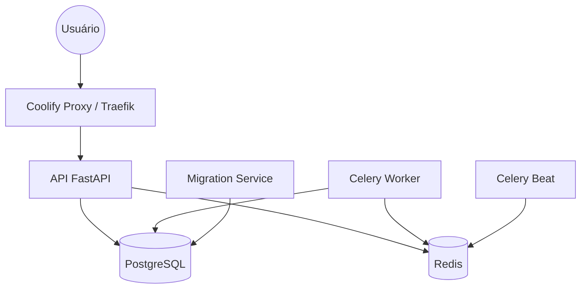

# Coolify Target Architecture (RemuneData API)

## 1. Visão Geral
A nova arquitetura abandona o acoplamento por IP e utiliza o **Docker DNS** nativo para comunicação entre serviços, garantindo portabilidade e compatibilidade total com o Coolify v4.0.0-beta.463.

## 2. Componentes e Topologia



### Serviços no Docker Compose
1.  **`api`**: Exposta publicamente via Coolify (Porta 8000). Responsável por servir a API e o Dashboard estático.
2.  **`worker`**: Processamento assíncrono.
3.  **`scheduler`**: Agendamento de tarefas (Sync diário).
4.  **`db`**: Banco de dados PostgreSQL com volume persistente.
5.  **`redis`**: Cache e broker para o Celery com volume persistente.
6.  **`migrate`**: Serviço transiente que aplica migrations do Alembic.

## 3. Estratégia de Migrations e Boot
Para evitar condições de corrida, a aplicação de migrations será isolada:
- O serviço `migrate` roda `alembic upgrade head` e finaliza com sucesso.
- Os serviços `api`, `worker` e `scheduler` dependem do `migrate` estar concluído (`service_completed_successfully`).
- O `entrypoint.sh` será simplificado para apenas verificar a disponibilidade do banco (retry loop) e executar o comando final, sem aplicar migrations.

## 4. Rede e Resolução de Nomes
- **Hostname do Banco**: `db`
- **Hostname do Redis**: `redis`
- **Rede**: `default` (Bridge gerenciada pelo Coolify).
- **Acesso Externo**: Somente a `api` recebe um FQDN (ex: `api.remunedata.com.br`).

## 5. Healthchecks e Rollout
- **API**: Healthcheck no endpoint `/health`.
- **Banco**: `pg_isready`.
- **Redis**: `redis-cli ping`.
- **Rollout**: O Coolify só direcionará tráfego para a nova versão da API quando o healthcheck reportar `healthy`.

## 6. Variáveis de Ambiente
Todas as variáveis serão injetadas via Coolify UI, permitindo segredos rotacionáveis e configurações por ambiente sem alteração de código.

| Variável | Valor Alvo (Interno) |
| :--- | :--- |
| `DATABASE_URL` | `postgresql+asyncpg://user:pass@db:5432/db_name` |
| `REDIS_URL` | `redis://:pass@redis:6379/0` |
| `DB_HOST` | `db` |
```
